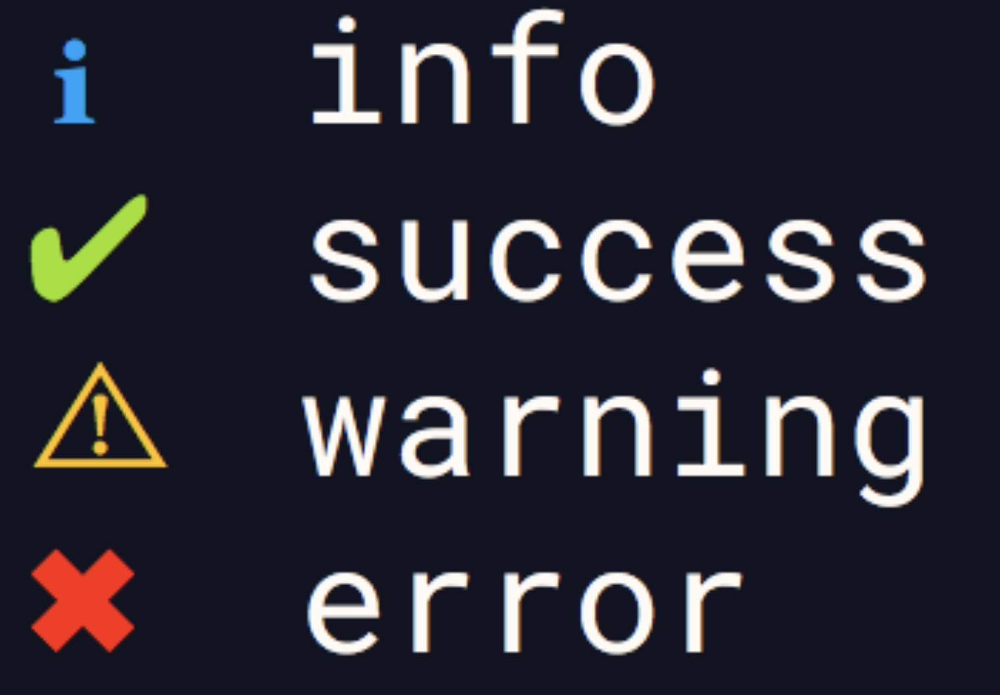

# log-symbols

[](https://godoc.org/github.com/defaltd/log-symbols) [](https://travis-ci.org/defaltd/log-symbols)



*A port of the NPM package by [Sindresorhus](https://github.com/sindresorhus) for Golang*

> Colored symbols for various log levels

Includes fallbacks for Windows CMD which only supports a [limited character set](https://en.wikipedia.org/wiki/Code_page_437).

## Install

```bash
go get "github.com/defaltd/log-symbols"
```

## Examples

```go
package main

import (
    logSymbols "github.com/defaltd/log-symbols"
)

func main() {
    fmt.Println(logSymbols.SUCCESS, "Finished successfully!")
    // On good OSes:  ✔ Finished successfully!
    // On Windows:    √ Finished successfully!
}
```

## License

MIT &copy; [Stephen Rodriguez](https://github.com/defaltd)
